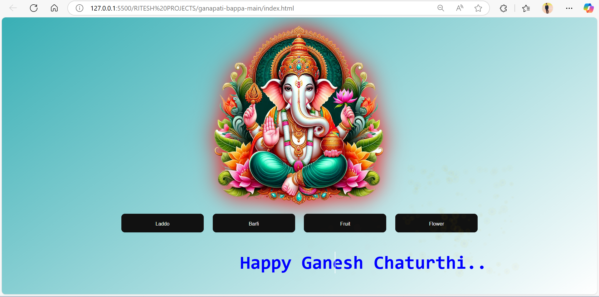

**# 🎉 Ganpati Bappa 🙏**

A festive web project to celebrate Ganesh Chaturthi with interactive buttons, animations, and a beautiful UI.

---

## 📸 Website Homepage



---

## 🌐 Live Demo

[- 🔗 Click here to view the live site on Netlify](https://ganpatibappasite.netlify.app/)

[- 🔗 Click here to view the live site on GitHub Pages](https://riteshraut0116.github.io/ganpati_bappa_html/)


---

## ✨ Features

- 🎨 Interactive buttons for offerings like **Laddu**, **Barfi**, **Fruit**, and **Flower**.
- 🌟 Particle animations triggered by button clicks.
- 📱 Responsive and visually appealing design.
- 💡 Custom glowing effects for buttons.

---

## 📂 Directory Structure

GANPATI_BAPPA_HTML [GITHUB]/
├── README.md
└── ganapati-bappa-main/
    ├── Pngtree—lord ganesh_14296248.png
    ├── barfi.png
    ├── flower.png
    ├── fruit.png
    ├── index.html
    └── laddu.png

---

## 🚀 How to Run

1. Clone the repository:
   ```bash
   git clone https://github.dev/Riteshraut0116/ganpati_bappa_html.git
2. Navigate to the ganapati-bappa-main directory.
3. Open index.html in your browser.

---

## 👤 Author

**Ritesh Raut**  
*Programmer Analyst, Cognizant*

🎊 Celebrate Ganesh Chaturthi with joy and devotion! 🐘

---
